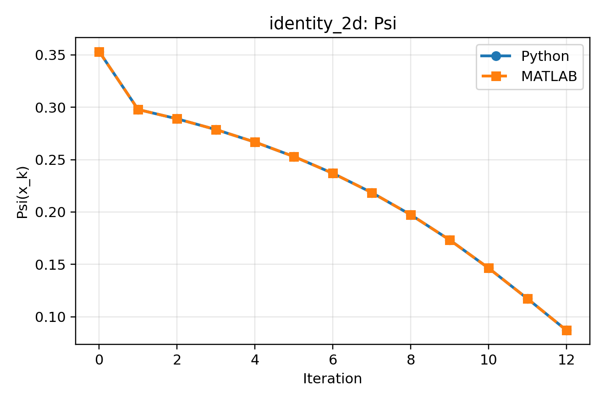
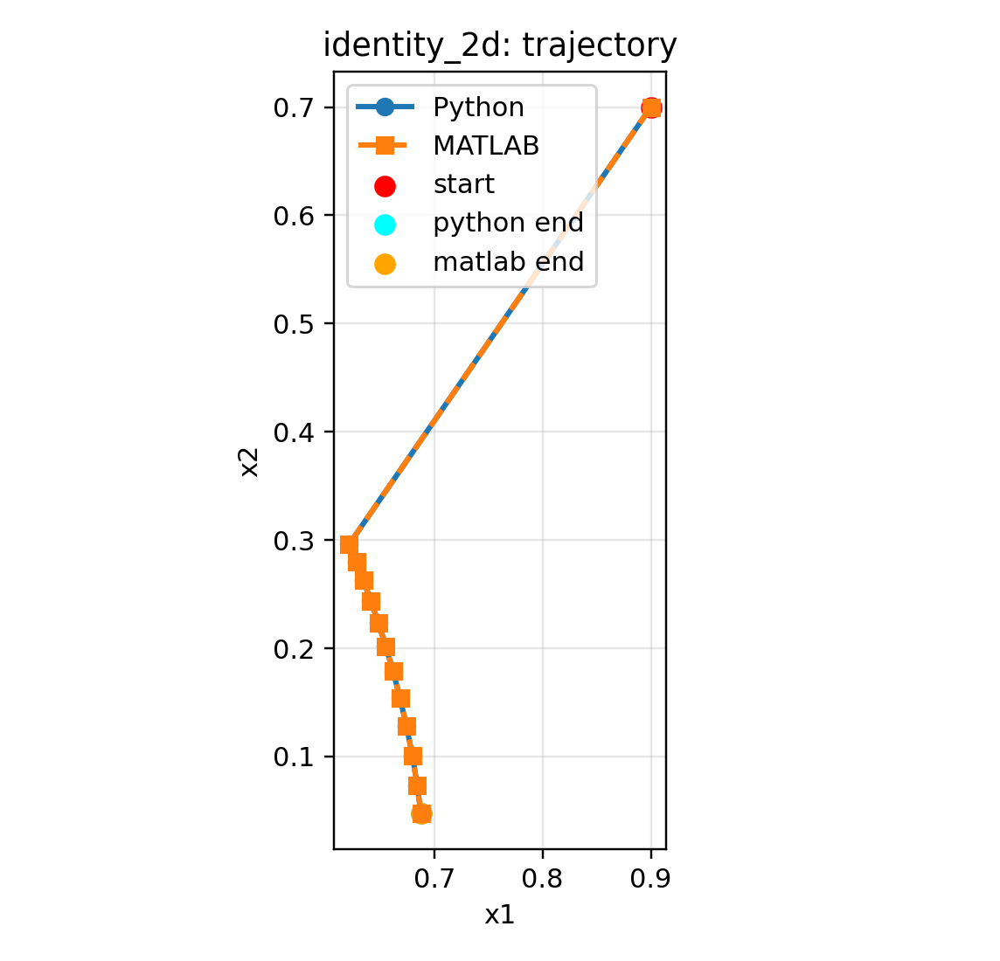
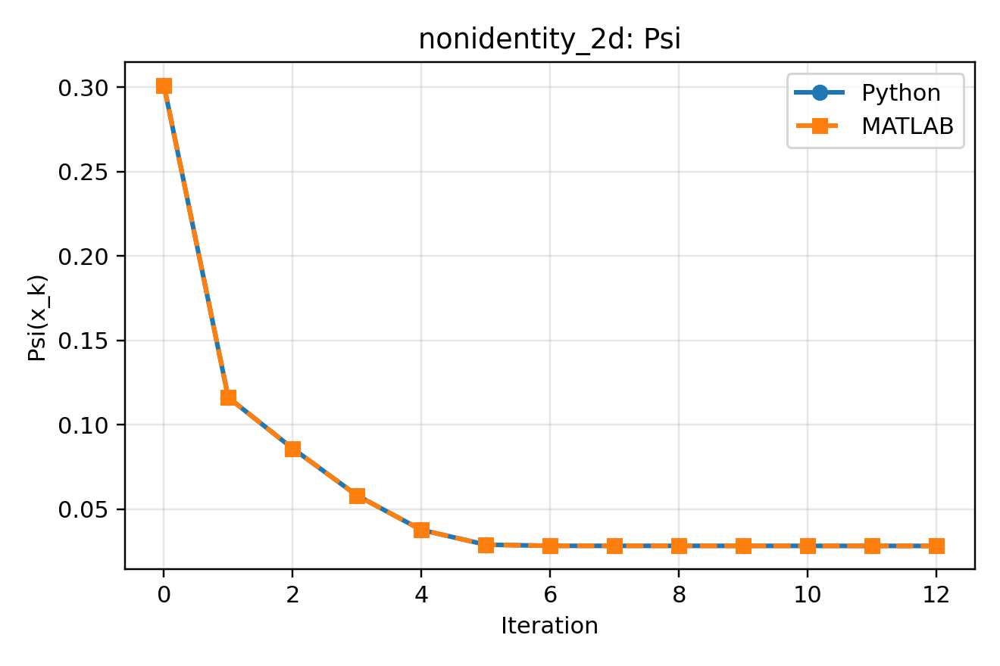
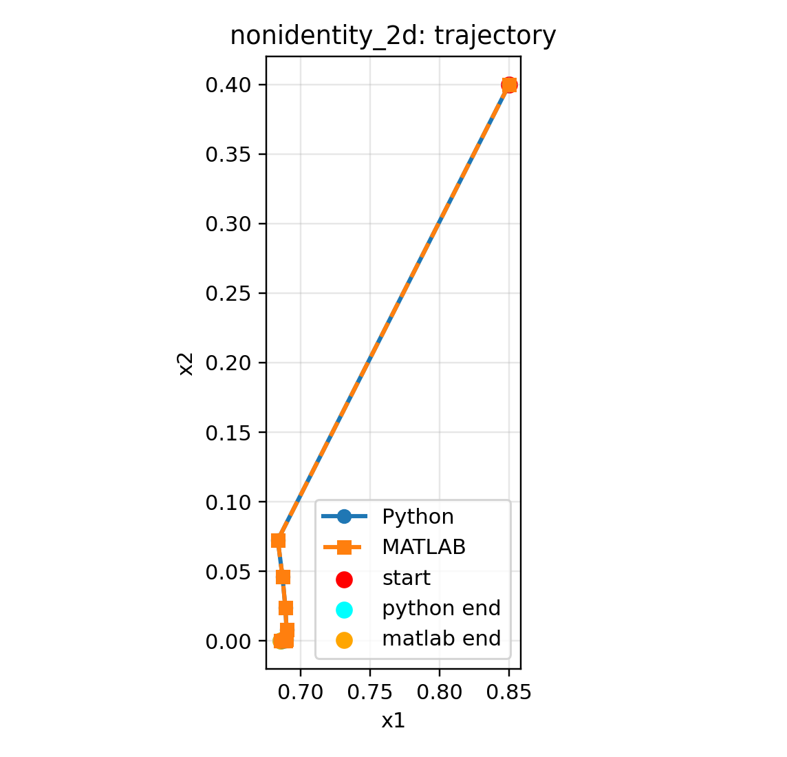
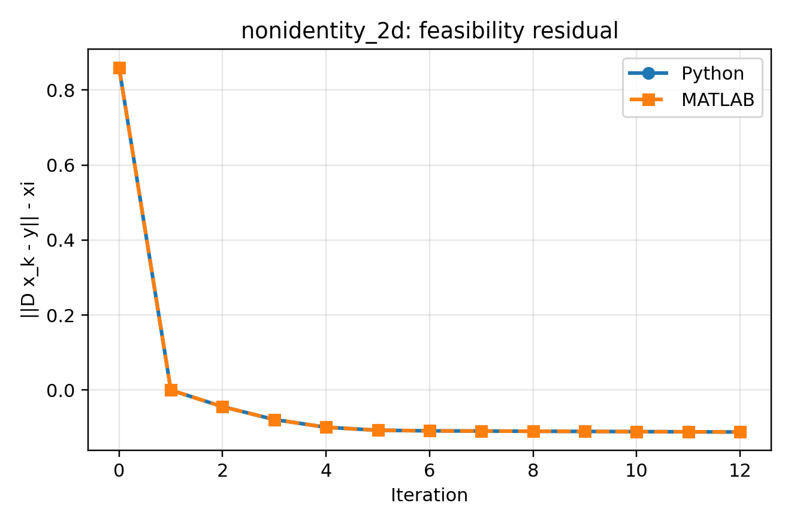

# Presentation
[Video presentation/demo](https://youtu.be/aMhJsjYpfdc)

# pySPOQ (Python SPOQ toolbox + interactive webapp)

Short project note:

- Core SPOQ penalty + gradient + metric implemented
- Prox / inner solver implemented
- Warm start (`pds`) implemented
- Full outer solver modes (including trust-region mode) implemented
- Simulated toolbox workflow implemented
- Local Streamlit app implemented (`webapp/`)

Validation/proof is summarized here:

- `docs/VALIDATION_SUMMARY.md`

## Start (quick)

```bash
# Create a venv using whatever you use, then:
pip install -r requirements.txt
python3 -m streamlit run webapp/app.py
```
The web-app will open and you're ready to go.

Run tests:
```bash
pytest -q tests/
```

## Quick validation (MATLAB parity)

- Python implementation reproduces MATLAB behavior on 2D identity and 2D non-identity parity cases.
- Full trajectories are compared (`x_k`, `Psi(x_k)`, feasibility, step norms).
- Detailed short note: `docs/VALIDATION_SUMMARY.md`

Identity case:




Non-identity case:




